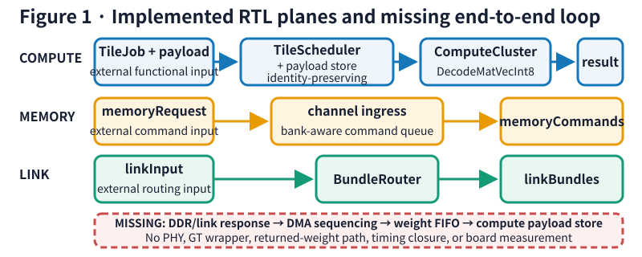
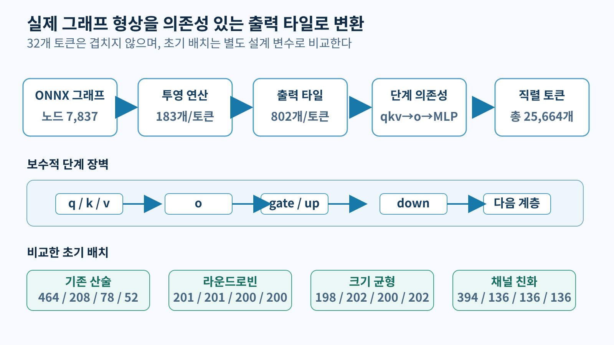
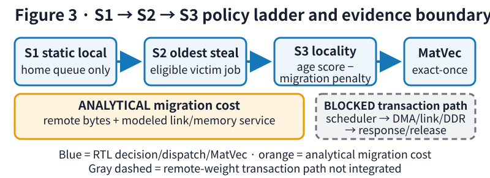
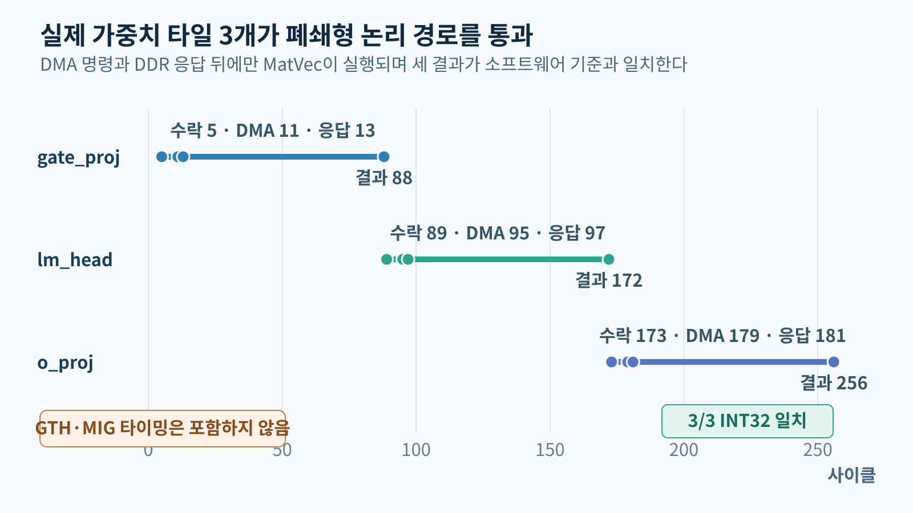
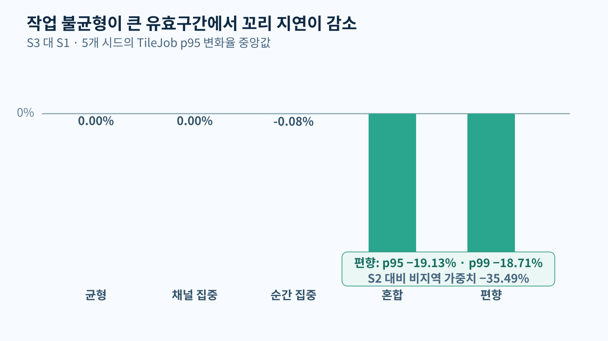
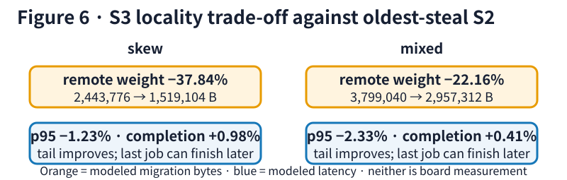
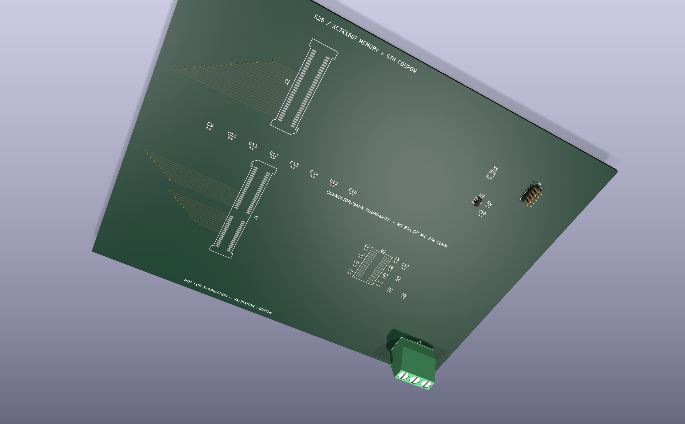

# 초록

온디바이스 LLM 복호화는 투영 가중치를 반복해서 읽으므로 정적 작업 소유권에서 생긴 큐·메모리 불균형이 꼬리 지연을 지배할 수 있다. 본 연구는 실제 Gemma 3 1B 그래프에서 작업 목록을 만들고, K26 연산 소유권과 외부 Memory FPGA의 채널 친화도를 분리한 후보 구조에서 정적 S1과 지역성 인지 워크 스틸링 S3를 동일 조건으로 감사한다. 완전 중첩 서비스 모델에서 S3는 skew와 mixed의 p95를 S1보다 18.12%와 17.59% 낮추고 S2보다 원격 가중치 전송량을 37.84%와 22.16% 줄였지만, 순차 서비스에서는 skew의 S2/S3 순위가 뒤집혔다. Gemma 3 1B의 context-32K 용량 모델 2.4301 GiB는 명목 K26 로컬 4 GB에도 들어가므로 외부 8 GiB 채택은 용량이 아니라 로컬 메모리 대역폭·경합·전력 검증에 달려 있으며, 본 방법은 그 채택 조건과 다음 실험을 명확히 선택하게 한다.

**핵심어:** Gemma 3 1B, Kria K26, Memory FPGA, 다채널 DDR3L, Work Stealing, SpinalHDL, KiCad

# Abstract

On-device LLM decoding repeatedly streams projection weights, so queue and memory imbalance under static ownership can dominate tail latency. We derive a job ledger from the actual Gemma 3 1B graph and audit static S1 against locality-aware work stealing S3 on a candidate architecture that separates K26 compute ownership from external Memory FPGA channel affinity. Under a full-overlap service model, S3 reduces p95 latency by 18.12% and 17.59% on skew and mixed workloads and reduces remote-weight bytes against S2 by 37.84% and 22.16%, while a sequential service boundary reverses the skew S2/S3 ordering. Because the 2.4301-GiB context-32K capacity model fits nominal K26 local 4 GB, external 8 GiB remains conditional on local-memory bandwidth, contention, and power validation; the method identifies the adoption gates and next experiments.

**Keywords:** Gemma 3 1B, Kria K26, Memory FPGA, multi-channel DDR3L, work stealing, SpinalHDL

# I. 서론

작은 배치의 LLM 복호화는 같은 투영 가중치를 토큰마다 다시 사용한다. 이때 연산 클러스터를 여러 개 두어도 작업이 특정 클러스터나 메모리 채널에 몰리면 일부 클러스터는 놀고 다른 큐의 p95와 p99는 길어진다. 유휴 클러스터가 다른 큐의 작업을 가져오는 워크 스틸링(work stealing)은 이를 줄일 수 있지만, 가중치와 활성값의 원격 이동을 만든다. 따라서 핵심 질문은 “스틸링이 빠른가”가 아니라 “어떤 작업을 언제 옮기면 꼬리 지연 감소가 이동 비용보다 큰가”이다.

본 연구는 이 질문을 K26–Memory FPGA 후보 구조의 채택 조건 평가로 구체화한다. K26 대상 기능 RTL은 네 연산 클러스터와 signed-INT8 MatVec primitive를 수행한다. Memory command와 link routing은 compute payload와 연결되지 않은 독립 입력 평면으로 구현되어 있다. 스케줄러는 큐 소유권을 보존하면서 작업 나이와 지역성 벌점을 계산하지만, 실제 DDR 응답을 받아 MatVec에 주입하는 end-to-end 경로는 없다.

그림 1은 구현과 제안의 경계를 포함한 현재 구조를 먼저 보여준다. TileScheduler, payload store, ComputeClusterArray와 DecodeMatVecInt8의 compute path는 연결되어 있다. 반면 `memoryRequest→memoryCommands`와 `linkInput→linkBundles`는 외부 입력으로 시작하는 별도 command/routing plane이며 response, DMA sequencing, PHY 또는 compute payload store 연결이 없다. 세부 증거 등급과 허용 주장은 표 3에서 고정한다.

의사결정 사슬은 다음과 같다. **문제**는 정적 home ownership의 큐·채널 쏠림이 꼬리 지연을 만드는가이다. **후보**는 K26 연산 소유권과 외부 4-channel Memory FPGA 친화도를 분리한 조건부 설계다. **정책 사다리**는 S1(static local)→S2(oldest eligible steal)→S3(age+locality steal)이고, S0는 이상적 중앙 기준선이다. **결정**은 S3의 조건부 꼬리 지연·전송량 이득은 관측하되, 외부 Memory FPGA 채택과 중앙·분산 큐의 물리 우열은 로컬 메모리 및 물리 구현 기준선이 생길 때까지 보류하는 것이다.

기여는 세 가지다. (1) 실제 ONNX graph-derived 작업 목록, (2) 동일 작업 목록에서 꼬리 지연·완료 시간·원격 전송량을 함께 보는 정책 감사, (3) 제한된 RTL·물리 검증 관문과 주장 경계의 연결이다. S3 알고리즘 자체의 신규성이나 보드 성능은 주장하지 않는다.

# II. 관련 연구와 차별점

PagedAttention은 serving 환경의 KV-cache paging과 fragmentation을 다루고[1], FlashAttention은 IO-aware tiling으로 attention의 memory movement를 줄인다[2]. GPTQ, SmoothQuant와 AWQ는 저비트 양자화에서 모델 크기와 정확도의 균형을 연구한다[3–5]. 이들은 memory traffic이 중요한 이유를 설명하지만, K26 cluster의 local queue에서 Memory FPGA channel로 이동하는 TileJob의 ownership과 stealing traffic을 직접 다루지 않는다.

FTRANS, DFX와 FlightLLM은 Transformer의 FPGA mapping, multi-FPGA 확장과 end-to-end 실행을 제시했다[6–8]. 본 연구는 이들과 최고 처리량을 경쟁하지 않는다. 차별점은 실제 ONNX graph를 scheduler ledger로 연결하고, queue policy의 p95·p99, remote-weight byte, actual MatVec parity와 제한된 PCB coupon을 동일한 evidence chain에서 감사한다는 데 있다. Scheduler 결과는 physical throughput이 아니라 architecture decision을 위한 event-driven model이다.

고전적 work stealing은 dependency가 있는 multithreaded computation의 load balance와 이론적 bound를 제공한다[15]. LAWS는 multisocket NUMA에서 shared-cache와 remote-memory locality를 online profiling으로 조정한다[16]. 본 연구의 S3는 이 계열보다 새롭다고 주장하지 않는다. 표 1은 알고리즘 우월성이 아니라 실제 LLM 그래프→스케줄러→제한된 RTL·물리 관문의 추적 가능성을 비교한다.

**표 1. 가장 가까운 연구와 contract-level evidence 비교**

| 연구 | Work ownership | Data locality | Remote-byte 회계 | 실제 LLM graph | RTL 시간 증거 | Physical gate |
|---|---|---|---|---|---|---|
| Classic work stealing[15] | deque/task | 고려 안 함 | 통신 bound | 아니오 | 아니오 | 아니오 |
| LAWS NUMA scheduler[16] | socket queue | profiling 기반 | remote access 최적화 | 아니오 | 아니오 | 아니오 |
| DFX[7] | multi-FPGA static mapping | partition 기반 | inter-FPGA 설계 | 실제 model | hardware system | 본 연구와 다른 appliance |
| FlightLLM[8] | compiled dataflow | mapping 기반 | memory/dataflow 평가 | 실제 model | FPGA mapping | 구현 flow |
| 본 연구 | TileJob identity | age/locality score | policy별 modeled byte | Gemma graph-derived | 세 steal→MatVec | bounded KiCad gate |

표의 차이는 우월성 순위가 아니다. 본 연구는 actual graph와 제한된 temporal/physical evidence를 하나의 claim audit에 연결하지만, non-stealing dynamic placement와 기존 locality-aware stealing을 동일 ledger에서 비교하지 않았다.

DRAMsim3는 channel, bank, row와 timing constraint를 cycle 수준에서 계산한다[9]. 이 공개 저장소에는 runnable adapter가 없고 `results/runs/dramsim3-snapshot/dramsim_stats_ch4.json`의 과거 4-channel 통계 snapshot과 설정만 보존한다. 이 snapshot은 Gemma scheduler replay와 cycle-by-cycle로 결합되지 않았고 `make reproduce`가 재생성하지 않으므로 Gemma J/token에 합산하지 않는다. KiCad ERC/DRC도 선언한 전기 규칙만 검사한다[14]. 각 산출물의 허용 범위는 표 3을 따른다.

# III. 실제 Gemma 3 1B workload와 설계 목표

## A. Graph-derived trace

입력 artifact는 로컬 read-only Gemma 3 1B ONNX model과 external-data file이다. ONNX와 external data의 SHA-256은 각각 e63d7c5e59f8c54a17cb7302529350a186b173701c4809db1b4eb1fd43602ad2와 c10ce493923725d45cae3c299ba2f8b9b6fe9183d93e88992595dd70db4b47e5다. Graph inventory는 7,837개 node를 순서대로 보존한다. Decode token당 dense projection은 attention의 q, k, v, o 104개, MLP gate, up, down 78개, lm_head 1개로 총 183개다.

원본 float32 projection initializer는 3,999,006,720 byte다. 본 평가의 coarse INT8 배치는 이를 999,751,680 byte로 모델링한다. 여기서 **context-32**는 KV 과거 길이 32를 뜻하며 float32 KV cache 산술은 1,703,936 byte다. 뒤의 **context-32K**는 용량 모델의 KV 문맥 길이 32,768로, 32개의 생성 토큰을 뜻하는 **decode-32**와도 다르다.

그래프 추출 경로와 ONNX Runtime 실행 경로는 분리한다. 전자는 `onnx.checker.check_model`과 external tensor를 적재하지 않는 protobuf graph load로 node 이름·연산·shape·initializer·external-data offset을 읽는다. 후자는 Y700의 ONNX Runtime Android CPU Execution Provider에서 batch 1, sequence length 1, artificial past length 1 조건으로 측정한 세 번의 기능 참조이며 평균 wall clock은 408.445 ms였다. 이 ORT 세션은 본 평가의 decode-32 `token_trace.jsonl`이나 183×32 TileJob ledger를 재실행하지 않았고 RTL·DRAMsim3·가속기 시간도 아니다. 혼합 결과는 이 Y700 실행에서 분리한 비투영 시간을 투영 분석 모델과 합친 값이다. 그림 2는 hash-bound ONNX artifact가 graph inventory와 projection ledger로 변환되는 경로, 그리고 별도 ORT 기능 참조의 경계를 함께 나타낸다.

## B. 실제 weight tile과 RTL parity

Attention output, MLP gate와 lm_head initializer에서 각각 연속된 16×4 float32 tile을 external-data offset으로 읽었다. 각 tile은 최대 절댓값을 127에 대응시키는 대칭 per-tile INT8 양자화를 적용하고 zero point를 0으로 고정했다. 입력 vector, scale, source offset과 tile hash를 fixture에 기록했다. 세 fixture는 실제 ComputeCluster/DecodeMatVecInt8 경로에 주입되었고 INT32 software reference와 정확히 일치했다.

이 parity는 중요한 최소 연결 증거다. Graph의 실제 weight byte가 accelerator의 실제 signed INT8 multiplier 경로까지 도달한다. 그러나 세 개 16×4 tile만 검증했으므로 model-wide quantization accuracy, 모든 projection의 layout, full-model inference 또는 K26 timing을 증명하지 않는다.

표 2는 실제 그래프에서 직접 얻은 값과 용량 산술·RTL 결과를 분리한다.

**표 2. Gemma workload와 증거 경계**

| 항목 | 값 | 증거 유형 | 허용되는 해석 |
|---|---:|---|---|
| ONNX graph node | 7,837 | graph-derived | 실제 artifact의 graph inventory |
| Projection/token | 183 | graph-derived | q/k/v/o, MLP 3종, lm_head 순서 |
| Float32 projection weight | 3,999,006,720 B | graph-derived | initializer byte 합 |
| Modeled INT8 projection weight | 999,751,680 B | capacity arithmetic | coarse resident/traffic model |
| 실제 weight tile parity | 3/3 | RTL-simulated | 제한된 16×4 MatVec 정확성 |
| Y700 기능 참조 | 408.445 ms 평균 | host-measured | 과거 단일-token CPU EP 조건 |

# IV. K26–Memory FPGA 시스템

K26는 control, activation과 hot working set을 담당하고 네 compute cluster로 TileJob을 분배한다. 용량만 보면 Gemma 3 1B의 INT8 context-32K budget 2.4301 GiB는 명목 K26 local 4 GB 후보에 들어가므로 외부 8 GiB의 필요성은 capacity로 입증되지 않는다. 본 연구는 external capacity expansion, independent channel bandwidth와 weight-service isolation을 서로 다른 가설로 분리하며, K26 local-memory의 effective bandwidth·경합·전력 baseline 없이 외부 memory가 필요하다고 주장하지 않는다.

분석 모델의 TileJob은 명시적 home cluster를 가지지만 RTL TileJob은 job ID, arrival, layer/op, activation ID, weight/output address, K/N 범위, preferred channel·bundle, reduction owner, priority와 stealable flag를 가지며 `jobId % clusterCount`로 home queue를 정한다. Scheduler가 queue 간에 job을 이동해도 identity는 바뀌지 않는다. Input ID set, dispatch ID set과 completion ID set이 같고 duplicate completion이 0이어야 정상이다.

네 논리 link bundle은 serializer, credit, CDC, outstanding table, response serializer와 consumer FIFO wait를 분리해서 센다. TileJob queue와 transport FIFO도 별도 경계다. 전자는 “누가 실행할지”, 후자는 “byte가 언제 이동할지”를 결정한다. 이 둘을 합치면 queue imbalance와 link backpressure의 원인을 구분할 수 없다.

표 3은 이후 모든 수치에 적용할 증거 등급, 정의와 허용 주장을 한곳에 고정한다.

**표 3. 증거 등급과 허용 주장**

| 등급 | 정의와 대표 산출물 | 허용 주장 | 금지·보류 주장 |
|---|---|---|---|
| Direct | 원본 ONNX/external-data hash, host 측정, native KiCad 결과 | 해당 산출물의 node·byte·측정 조건·검사 결과 | 다른 장치 성능, 완성 보드 동작 |
| RTL-simulated | actual Gemma tile→MatVec 3/3 parity; synthetic scheduler→payload→MatVec exact-once | 각 독립 경로의 제한된 기능·시간 동작 | 실제 Gemma가 scheduler·DMA/DDR를 통과한 end-to-end 실행 |
| Graph-derived | graph inventory와 decode-1/decode-32 projection order·shape·byte | 실제 모델에서 유도한 작업 순서와 크기 | 실제 decode-32 ORT execution trace 또는 물리 배치 |
| Modeled | S0–S3 event model, overlap 경계, energy·DRAM-die cost | 명시한 식 안의 p95·전송량·민감도·정규화 | 물리 protocol timing, 전체 보드 J/token·가격; S0 0 B와 +7 cycle은 정의·한 점 민감도 |
| Blocked | dispatch→DMA/link/DDR→MatVec release, Vivado·SI/PI·board | 다음 검증 관문 식별 | 중앙/분산 큐의 물리 우열, 제작·실측 성능 |

표 4는 외부 8 GiB 후보를 용량·대역폭·격리·확장 질문으로 나눠 채택 근거의 현재 상태를 보여준다.

**표 4. 외부 8 GiB 후보 설계의 가설과 판정**
| 가설 | 본 논문 evidence | 판정 |
|---|---|---|
| Gemma 1B capacity expansion | 2.4301 GiB at INT8 context-32K | 불필요; nominal local 4 GB에도 fit |
| Independent channel bandwidth | 4×x16 pin-rate 산술과 analytical service | local-memory 실효 bandwidth baseline 부재 |
| Weight-service isolation | queue/channel analytical counters | host/local contention 측정 부재 |
| 3B·long-context 확장 | generic capacity arithmetic | 실행 증거 아님 |

외부 메모리 baseline은 네 개의 x16 channel이다. 각 channel은 8 Gb x8 package 두 개로 2 GiB를 구성하고 전체 8 GiB가 된다. 분석 부품 AS4C1G8D3LA-10BCN은 package 내부에 두 개의 4 Gb x4 die가 적층되어 하나의 x8 rank로 보인다. 800 MT/s 가정의 산술 pin-rate 상한은 4×16×800/8 = 6.4 GB/s다. Effective payload는 controller, refresh, turnaround와 protocol overhead 때문에 더 낮다.

# V. Multi-Queue FCFS와 지역성 인지 Work Stealing

S0는 idealized global FIFO다. 빈 cluster가 central queue에서 다음 job을 가져가므로 imbalance의 낮은 기준을 주지만 global arbitration, fanout과 crossbar 비용을 단순화한다. S0-physical은 central control cycle을 추가한 분석 모델이다. S1은 home cluster의 local FIFO에서만 실행한다. S2는 idle cluster가 oldest eligible job을 훔친다. S3는 age에서 remote weight, activation residency, reduction ownership과 bundle mismatch penalty를 뺀 locality score가 양수인 job을 선택한다. Oracle은 전체 ledger를 미리 아는 offline list scheduler이며 수학적으로 증명된 optimum이 아니다.

그림 3은 S3의 victim 탐색부터 exact-once completion까지 정책 순서를 보여준다. 유휴 클러스터는 local queue가 빈 것을 확인하고 victim을 탐색한다. 작업이 stealable하고 dependency가 준비되었는지 검사한 다음 age/locality score를 계산한다. 분석 모델에서는 선택된 작업을 원격 요청과 전송량으로 회계하며, 계측 RTL에서는 dispatch identity가 actual MatVec까지 보존된다.

S3는 보편적으로 우월하도록 설계되지 않았다. Balanced workload에서는 이동할 필요가 없고, hotspot은 memory channel 자체가 병목일 수 있다. Remote weight가 큰 job은 S2보다 덜 옮겨 traffic을 줄이지만, 그 선택 때문에 completion이 늦어질 수 있다. 본 평가의 핵심은 이 trade-off를 p95·p99와 byte 양쪽에서 정량화하는 것이다.

S3 score의 age/locality 계수와 양수 threshold는 calibration이나 exhaustive sensitivity를 거치지 않은 한 design point다. Dynamic least-loaded, join-shortest-queue 또는 affinity-aware initial placement 같은 non-stealing online baseline도 실행하지 않았다. 따라서 S3는 static ownership에서 tail을 줄이는 한 방법이며 구조적으로 필요하다는 결론은 보류한다.

# VI. RTL, 분석 모델, 전력·비용 평가 방법

## A. 실제 RTL 시간 증거

WorkStealingEvidenceTop은 production TileScheduler S3, payload identity store와 실제 ComputeClusterArray를 연결한 계측 harness다. Victim queue에 job 1, 5, 9를 넣고 cluster 0을 idle하게 둔 skew case에서 cycle 16–18에 세 번의 steal이 발생했다. 이후 실제 MatVec start와 result를 관측하고 accepted=dispatched=completed=3, successfulSteals=3을 확인했다. 그림 4는 이 세 dispatch와 MatVec start/result의 시간 관계를 보존한다.

이 harness는 synthetic 정책과 소비자 사이의 시간적 연결을 직접 지지한다. 실제 Gemma weight parity test와의 관계 및 미통합 구간은 표 3의 RTL-simulated/blocked 경계를 따른다. 3-job fixture의 latency를 Gemma projection 성능으로 사용하지 않으며 S0–S3 비교와 Gemma 5,856-job replay는 event-driven analytical model이다.

Python event model과 RTL scheduler는 동일 구현이 아니다. Python은 명시적 `home_cluster`를 사용하고 victim queue의 모든 eligible job을 탐색하며 byte/service-dependent locality penalty를 적용하고 같은 event time에 여러 cluster를 dispatch할 수 있다. RTL은 `jobId % clusterCount` ownership, victim head-only FCFS, 고정 정수 penalty와 clock edge당 최대 한 dispatch를 사용한다. 또한 분석 기본값은 64 MAC/cycle이지만 실제 16×4, tileDim=1 MatVec는 64 MAC의 request-to-done에 65 cycle이 걸린다. 따라서 분석 cycle은 RTL cycle 예측이 아니며 현재 issue-rate 차이는 65배다. 이 보정은 공개 저장소의 `docs/calibration.md`와 RTL test로 고정한다.

| 계약 항목 | Python 분석 모델 | 현재 RTL |
|---|---|---|
| Home queue | 명시적 `home_cluster` | `jobId % clusterCount` |
| Victim 후보 | queue 내부 전체 eligible job | victim queue head만 |
| Locality cost | byte/service-dependent | 고정 정수 penalty |
| Dispatch 폭 | event time당 복수 가능 | edge당 최대 1 |
| 64 MAC service | 기본 1 analytical cycle | 65 request-to-done cycle |

## B. 공정한 scheduler 비교

Synthetic scheduler subset은 balanced, skew, hotspot, bursty, mixed 각 1,000 job을 seed 19, 23, 29, 31, 43으로 생성한다. 모든 정책은 동일 job stream, 네 cluster, 네 channel, 네 bundle과 128-bit link를 사용한다. Process repetition 3회는 동일 seed의 deterministic 복원을 검사하며 표본 수로 세지 않는다. 결과는 repetition 0의 seed 5개 중앙값으로 요약한다. 780개 전체 row는 factor sweep을 포함하지만 본문 scheduler 비교는 subset=scheduler만 사용한다.

모델은 arrival, cluster, link와 channel availability의 다음 event로 진행한다. Weight byte는 K×N, activation byte는 K, output byte는 4N으로 계산한다. 기본 full-overlap mode는 같은 dispatch-ready 시점에서 link와 memory service를 시작하고 data-ready=max(link-end, memory-end)로 둔다. Sequential sensitivity는 data-ready=link-end+memory-service로 직렬화한다. 둘 다 transaction-level DMA/PHY를 재현한 물리 timing이 아니라 경계 가정이다. DRAM bank timing, physical PHY와 FPGA clock closure도 포함하지 않는다. 모든 정상 row는 1,000 input/completed ID 일치, duplicate 0, timeout false를 통과해야 한다.

클러스터 지표는 아래 두 용어로 고정한다. `unreserved idle`은 예약되지 않은 cluster-cycle count이며 compute-idle과 다르다.

| 지표 | 고정 정의 |
|---|---|
| compute duty | compute-cycle 합 ÷ (cluster 수×completion time) |
| reservation occupancy | dispatch부터 link/memory wait와 compute 완료까지의 예약 구간 합 ÷ (cluster 수×completion time) |

`reservation occupancy`가 0.99에 가까워도 MAC array가 99% 계산했다는 뜻은 아니다.

Baseline traffic 회계는 대칭이 아니다. S2/S3는 stolen job의 home cluster와 dispatch cluster가 다를 때 remote weight·activation·partial sum을 센다. S0/S0-physical은 global queue에서 어느 cluster로 보내도 remote traffic을 정의상 0으로 둔다. 따라서 표의 S0 0 B는 관측이 아니라 중앙 공유 storage를 암묵적으로 가정한 baseline 정의다. S0-physical도 synthesis에서 얻은 비용이 아니라 arbitration 2, fanout 2, crossbar 3을 합한 임의의 +7 cycle/job sensitivity 한 점이다. 0/수십/수백 cycle이나 crossbar bandwidth sweep을 실행하지 않았으므로 중앙·분산 queue의 물리 비교는 미결정이다.

Gemma replay는 graph 순서의 183 projection을 token당 한 coarse job으로 변환한다. **decode-1**은 생성 토큰 1개의 183 job, **decode-32**는 생성 토큰 32개의 5,856 job이다. 이는 KV 길이 **context-32K**와 별개다. 배치는 graph-derived지만 timing, placement, scheduler와 link byte는 분석 모델이다. 한 개 deterministic 작업 목록만 사용했으므로 synthetic seed sensitivity를 대체하지 않는다.

## C. Power, energy와 memory-die cost

Vivado, device file과 license가 없어 synthesis, place-and-route, SAIF/VCD 기반 report_power는 수행하지 않았다. Compute energy는 1/5/15 pJ per INT8 MAC, serialized link는 24/51.2/120 pJ per bit의 low/central/high 범위를 둔다. DDR3L은 ACT, PRE, READ, WRITE, REFRESH와 idle state의 command/background 식을 분리한다. 기존 DRAMsim3 breakdown은 Gemma replay와 cycle-by-cycle로 결합되지 않았다. Energy join의 link 항은 base projection stream과 scheduler별 steal-overhead byte를 합친다. Graph-derived MAC·byte count와 analytical dynamic READ+ACT+PRE 단위를 결합하되 refresh, idle, controller, PHY와 board power는 제외한다.

가격 경계는 DRAM package와 그 내부 physical die뿐이다. K26, Memory FPGA, PCB, regulator, connector, 조립비는 제외한다. 2026-07-31의 AS4C1G8D3LA-10BCN quantity-1 snapshot은 Mouser 39.32 USD와 DigiKey 97.10 USD다. 이 가격은 변동 가능한 시점 자료이므로 조달 전에 갱신해야 한다. Package에 두 die가 있으므로 physical-die dollar는 package 가격을 2로 나눈 정규화 산술이지 구매 가능한 bare-die quote가 아니다.

# VII. 질문별 결과와 설계 결정

## A. Q1 — Stealing은 언제 tail을 줄이는가?

**답:** 정적 소유권의 큐 불균형이 큰 skew와 mixed에서는 줄지만, balanced와 channel-hotspot에서는 줄지 않는다. Balanced의 S0–S3 p95는 모두 19,524 cycle이고 successful steal은 0이다. Hotspot에서도 S1과 S3의 p95가 159,940 cycle로 같다.

Full-overlap mode에서 skew S1 p95는 285,333 cycle, S3는 233,625 cycle로 18.12% 낮다. Mixed에서는 478,553에서 394,375 cycle로 17.59% 낮다. Skew S1→S3의 compute duty는 0.057097→0.068999, reservation occupancy는 0.336200→0.994864, unreserved idle은 811,713→5,137 cycle이다. Mixed는 각각 0.068345→0.080889, 0.413076→0.996291, 1,210,683→6,432 cycle이다. 그림 5는 workload별 percentile을 같은 축에서 비교한다.

같은 full-overlap 고정 row의 p99는 skew S1/S2/S3가 302,186.41/249,379.73/247,296.42 cycle, mixed가 506,354.73/426,120.83/422,255.59 cycle이다. 이는 분석 모델의 repetition 0, seed 5개 중앙값이며 physical timing이 아니다. S3의 S2 대비 p99 차이는 각각 −0.84%, −0.91%로 작다.

현재 비용 정의에서 S0는 synthetic p95 하한을 제공한다. Skew의 S0 p95는 226,611 cycle이고 mixed는 378,232 cycle이다. S0-physical의 단일 +7 cycle/job도 순위를 바꾸지 않는다. **판정:** S3는 정적 큐 불균형이 큰 조건의 후보로 유지하고, 범용 정책 채택은 보류한다.

## B. Q2 — S3는 S2보다 무엇을 얻고 잃는가?

**답:** 지역성 벌점은 원격 가중치 전송량과 p95를 줄이지만 마지막 작업 완료를 늦출 수 있다. Skew에서 S2→S3 remote weight는 2,443,776→1,519,104 B로 37.84%, mixed에서는 3,799,040→2,957,312 B로 22.16% 감소한다. 동시에 S3 p95는 S2보다 skew 1.23%, mixed 2.33% 낮다.

Completion time은 반대 trade-off를 보인다. Skew에서 S2 253,424 cycle에 비해 S3는 255,897 cycle로 0.98% 길고, mixed에서는 432,283 대비 434,075 cycle로 0.41% 길다. Tail이 짧아져도 마지막 큰 job이 늦어질 수 있음을 뜻한다. 따라서 정책 선택은 p95만이 아니라 completion과 traffic을 함께 보아야 한다.

그림 6은 이 p95·steal·전송량 trade-off를 비교하고, 표 5는 compute duty, reservation occupancy, unreserved idle을 축약 없이 함께 제시한다.

**표 5. Full-overlap synthetic 결과의 seed 5개 중앙값**

| Workload | Policy | p95 cycle | Completion | compute duty | reservation occupancy | unreserved idle | Remote weight |
|---|---|---:|---:|---:|---:|---:|---:|
| Skew | S0 | 226,611 | 241,560 | 0.073365 | 0.997976 | 1,914 | 0 B |
| Skew | S1 | 285,333 | 306,837 | 0.057097 | 0.336200 | 811,713 | 0 B |
| Skew | S2 | 236,528 | 253,424 | 0.069318 | 0.998086 | 1,914 | 2,443,776 B |
| Skew | S3 | 233,625 | 255,897 | 0.068999 | 0.994864 | 5,137 | 1,519,104 B |
| Mixed | S0 | 378,232 | 396,401 | 0.087726 | 0.998087 | 3,034 | 0 B |
| Mixed | S1 | 478,553 | 513,745 | 0.068345 | 0.413076 | 1,210,683 | 0 B |
| Mixed | S2 | 403,766 | 432,283 | 0.081225 | 0.998245 | 3,034 | 3,799,040 B |
| Mixed | S3 | 394,375 | 434,075 | 0.080889 | 0.996291 | 6,432 | 2,957,312 B |

S0의 remote weight 0 B는 표 3의 modeled 정의다. 표 6은 서비스 경계를 바꾸면 S2/S3 순위가 얼마나 민감한지 보여준다.

**표 6. Link/memory service overlap sensitivity의 p95 중앙값**

| Workload | Service mode | S1 | S2 | S3 | S2↔S3 순위 |
|---|---|---:|---:|---:|---|
| Skew | Full overlap | 285,333.05 | 236,527.85 | 233,625.15 | S3가 1.23% 낮음 |
| Skew | Sequential | 499,243.85 | 260,052.10 | 264,294.60 | S2가 1.63% 낮음 |
| Mixed | Full overlap | 478,553.05 | 403,766.25 | 394,375.45 | S3가 2.33% 낮음 |
| Mixed | Sequential | 825,278.25 | 471,918.25 | 463,867.20 | S3가 1.71% 낮음 |

Sequential sensitivity에서도 S3는 S1보다 낮지만 S2와의 p95 순위는 skew에서 뒤집히고 mixed에서 유지된다. **판정:** S3는 전송량을 줄이는 후보이지만 S2 대비 tail 우위는 service composition에 의존하므로 물리 통합 전에는 보류한다.

## C. Q3 — Actual Gemma ledger에서도 같은 방향인가?

**답:** decode-1에서는 아니지만 decode-32 분석 모델에서는 같은 tail·전송량 방향이 나타난다. Decode-1에서 S1 projection은 220.126 ms, S3는 220.863 ms로 S3가 0.34% 길다. Decode-32에서는 S1 7.341 s, S3 6.335 s로 S3가 13.70% 짧다. S3 p95 job latency는 1.223×10⁹→1.039×10⁹ cycle로 15.08% 낮고, remote weight는 S2 4.855 GB에서 S3 2.830 GB로 41.71% 감소한다.

Host non-projection fallback 6.550 s를 선형 외삽해 합친 decode-32 hybrid total은 S1 13.891 s, S3 12.885 s, Oracle 11.819 s다. 표 7은 decode-1과 decode-32를 context-32K 용량 조건과 구별해 비교한다.

**표 7. Gemma 3 1B graph-derived decode-1/decode-32 coarse replay**

| Decode tokens | Policy | Projection time | Hybrid total | p95 job cycle | reservation occupancy† | Remote weight |
|---:|---|---:|---:|---:|---:|---:|
| 1 | S0 | 221.706 ms | 426.407 ms | 19,750,965 | 0.605 | 0 B‡ |
| 1 | S0-physical | 221.707 ms | 426.407 ms | 19,751,147 | 0.605 | 0 B‡ |
| 1 | S1 | 220.126 ms | 424.827 ms | 19,755,052 | 0.635 | 0 B |
| 1 | S3 | 220.863 ms | 425.564 ms | 19,064,335 | 0.597 | 68,714,496 B |
| 32 | S0 | 6.368 s | 12.918 s | 1,197,759,773 | 0.986 | 0 B‡ |
| 32 | S0-physical | 6.368 s | 12.918 s | 1,197,764,260 | 0.986 | 0 B‡ |
| 32 | S1 | 7.341 s | 13.891 s | 1,223,259,980 | 0.713 | 0 B |
| 32 | S2 | 6.509 s | 13.059 s | 1,219,938,210 | 0.986 | 4,855,431,168 B |
| 32 | S3 | 6.335 s | 12.885 s | 1,038,875,850 | 0.986 | 2,829,975,552 B |
| 32 | Oracle | 5.269 s | 11.819 s | 399,092,134 | 0.973 | 0 B |

† reservation occupancy는 VI-B의 고정 정의를 따른다. ‡ S0/S0-physical 0 B는 baseline 정의다. **판정:** decode-32는 실제 graph-derived 규모에서도 S3 후속 검증의 우선순위를 지지하지만, 표 3의 modeled 범위를 넘어 채택을 확정하지 않는다.

## D. Q4 — 외부 8 GiB와 energy/cost는 채택을 정당화하는가?

**답:** 아니다. 8 GiB topology는 8개 x8 package, 16개 physical 4 Gb die를 사용하고 low/high package snapshot에서 DRAM component 합은 314.56–776.80 USD다. 16 GiB는 두 번째 rank를 추가해 package와 cost를 두 배로 만들지만 pin-rate 상한은 6.4 GB/s로 같다.

Gemma 3 1B INT8의 **context-32K** capacity model은 weight 0.9313 GiB, KV 0.8125 GiB, runtime headroom 0.6863 GiB, 합계 2.4301 GiB다. Generic 3B INT8 context-32K case도 5.3528 GiB로 8 GiB 안에 들어가지만 이는 실행 증거가 아니다. context-131K 3B case는 9.8528 GiB로 8 GiB를 넘고 16 GiB에 들어간다. 표 8은 이 후보의 DRAM-die-only 비용 민감도를 보인다.

**표 8. Memory-die-only 비용 민감도**

| Capacity | Package / physical die | Package snapshot | DRAM component sum | 70% effective GB/s | Effective GB/s per die-dollar |
|---:|---:|---:|---:|---:|---:|
| 8 GiB | 8 / 16 | 39.32 USD | 314.56 USD | 4.48 | 0.014242 |
| 8 GiB | 8 / 16 | 68.21 USD | 545.68 USD | 4.48 | 0.008210 |
| 8 GiB | 8 / 16 | 97.10 USD | 776.80 USD | 4.48 | 0.005767 |
| 16 GiB | 16 / 32 | 39.32 USD | 629.12 USD | 4.48 | 0.007121 |
| 16 GiB | 16 / 32 | 97.10 USD | 1,553.60 USD | 4.48 | 0.002884 |

Decode-32 S3 중앙값은 `2.483495600 hybrid-modeled token/s ÷ 545.68 USD = 0.004551194106 hybrid-modeled token/s per DRAM-component-dollar`이다. 분모는 8개 DDR3L package의 DRAM component/die-only midpoint뿐이며 K26, Memory FPGA, PCB, controller, regulator, connector, cooling, assembly, tax, freight, software와 board power를 제외한다. 분자는 측정 throughput이 아니라 graph-derived projection 모델과 Y700 non-projection 선형 외삽을 결합한 값이므로 전체 accelerator performance/$ 또는 제품 가격이 아니다.

Energy join은 graph-derived MAC·weight·link byte와 hybrid latency를 low/central/high analytical unit에 결합한다. S3 decode-32의 link는 base 1,003,000,416 B/token에 steal overhead 88,806,088 B/token을 더한 1,091,806,504 B/token이다. Estimated dynamic energy는 0.291943317/0.553753651/1.185041645 J/token이고 central energy-delay product는 약 0.223 J·s/token이다. 표 3의 modeled 경계에 따라 이는 전체 보드 J/token이 아니다. **판정:** 외부 8 GiB는 용량·energy·cost만으로 채택하지 않고 로컬 메모리 대역폭·경합·전력 기준선이 이길 때만 유지한다.

# VIII. KiCad 물리 참조 설계

KiCad hierarchy는 K26 SOM GTH boundary, XC7K160T bank boundary, 네 DDR3L x16 topology, four-lane link, clock/reset/configuration, power/decoupling과 JTAG/debug를 포함한다. Coupon은 29 footprint, 116 net, 65 track segment, 50 via, 한 zone과 140×110 mm outline을 가진다. 그림 7은 체크인된 `k26_memory_coupon.kicad_pcb`를 KiCad CLI의 고정 camera·quality 설정으로 직접 렌더링한 설계 모습이다. 장식용 생성 이미지가 아니라 native board source의 3D view지만, 부품 모델·배선 완성도·제조 가능성을 보증하지 않는다.

Native 0건은 routing 완료를 뜻하지 않는다. 독립 분석기는 55개 unrouted net, 9개 high-speed return-path crossing, ground stitching 부재, test-point 0/116과 incomplete MPN/datasheet coverage를 찾았다. Geometry에는 0.10 mm annular ring, 10개 untented via-in-pad, 27개 front fiducial 부재가 남아 있다. Thermal analyzer는 부품의 MPN, dissipation과 thermal parameter가 없어 0개 component만 평가했다.

따라서 coupon이 직접 지지하는 것은 “제한된 connector/bank boundary model이 선언한 ERC/DRC와 export를 재현한다”는 명제뿐이다. 실제 BGA pin, 네 MIG bank placement, impedance, insertion loss, skew, jitter, eye margin, PDN, temperature와 EMC는 inference 또는 blocker다. Vivado MIG와 post-route timing이 닫히기 전 XC7K160T-2FFG676I는 conditional candidate다.

# IX. 논의와 다음 검증

결과를 바꿀 가능성이 가장 큰 미검증 가정은 세 가지다. 첫째, non-stealing dynamic placement와 S3 score sensitivity가 없어 Q1의 인과는 static S1 비교에 한정된다. 둘째, full-overlap과 sequential 경계 사이에서 skew S2/S3 순위가 바뀌므로 실제 DMA→DDR→response 순서가 Q2를 바꿀 수 있다. 셋째, 로컬 4 GB의 실효 대역폭·경합·전력과 외부 8 GiB의 전체 보드 비용이 없어 Q4의 구조 채택을 판정할 수 없다. 세 항목 모두 표 3의 modeled/blocked 등급에 해당한다.

따라서 다음 실험은 우선순위대로 진행한다. (1) actual Gemma tile stream과 scheduler dispatch를 RTL–DRAMsim3 command trace에 연결해 S2/S3 및 동적 non-stealing baseline을 비교한다. (2) Vivado에서 S0–S3와 1/2/4 cluster의 LUT, BRAM, Fmax, fanout, MIG placement와 SAIF 기반 power를 닫는다. (3) local 4 GB와 external 8 GiB를 동일 decode-32 조건에서 측정한 뒤에만 exact pin·stackup·SI/PI·thermal·CAM 및 board 제작으로 넘어간다.

# X. 결론

**관측.** 실제 Gemma 3 1B ONNX graph에서 유도한 동일 작업 목록으로 정책을 비교했을 때, S3는 skew와 mixed에서 static S1의 p95를 약 18% 낮추고 S2보다 remote-weight byte를 줄였다. Balanced와 hotspot에서는 이득이 없고 S2보다 completion이 조금 길었다. Decode-32에서도 같은 방향이 나타났지만 서비스 경계와 비대칭 S0 회계에 민감한 분석 모델 결과다.

**채택·보류.** S3는 static ownership의 불균형을 완화할 후속 RTL 후보로 채택한다. 외부 Memory FPGA와 중앙·분산 queue의 물리 선택은 보류한다. 실제 dispatch→DMA/DDR→MatVec 통합, 동적 non-stealing 비교, Vivado timing·power, local 4 GB 대비 대역폭·경합·전력 측정이 모두 통과하면 외부 Memory FPGA와 S3를 함께 채택할 수 있다.

# 참고문헌

[1] W. Kwon et al., “Efficient Memory Management for Large Language Model Serving with PagedAttention,” arXiv:2309.06180, 2023.

[2] T. Dao et al., “FlashAttention: Fast and Memory-Efficient Exact Attention with IO-Awareness,” arXiv:2205.14135, 2022.

[3] E. Frantar et al., “GPTQ: Accurate Post-Training Quantization for Generative Pre-trained Transformers,” arXiv:2210.17323, 2022.

[4] G. Xiao et al., “SmoothQuant: Accurate and Efficient Post-Training Quantization for LLMs,” arXiv:2211.10438, 2022.

[5] J. Lin et al., “AWQ: Activation-aware Weight Quantization for LLM Compression and Acceleration,” arXiv:2306.00978, 2023.

[6] B. Li et al., “FTRANS: Energy-Efficient Acceleration of Transformers using FPGA,” ISLPED, 2020.

[7] S. Hong et al., “DFX: A Low-latency Multi-FPGA Appliance for Accelerating Transformer-based Text Generation,” MICRO-55, 2022.

[8] S. Zeng et al., “FlightLLM: Efficient Large Language Model Inference with a Complete Mapping Flow on FPGAs,” arXiv:2401.03868, 2024.

[9] S. Li et al., “DRAMsim3: A Cycle-Accurate, Thermal-Capable DRAM Simulator,” IEEE Computer Architecture Letters, vol. 19, no. 2, 2020.

[10] AMD, Kria K26 SOM Data Sheet DS987.

[11] AMD, Kria SOM Carrier Card Design Guide UG1091.

[12] AMD, 7 Series FPGAs Packaging and Pinout UG475.

[13] AMD, 7 Series FPGAs Memory Interface Solutions UG586.

[14] KiCad Project, KiCad 9 Documentation, ERC and DRC reference.

[15] R. D. Blumofe and C. E. Leiserson, “Scheduling Multithreaded Computations by Work Stealing,” Journal of the ACM, vol. 46, no. 5, pp. 720–748, 1999.

[16] Q. Chen et al., “Locality-Aware Work Stealing Based on Online Profiling and Auto-Tuning for Multisocket Multicore Architectures,” HPDC, 2015, doi:10.1145/2766450.

