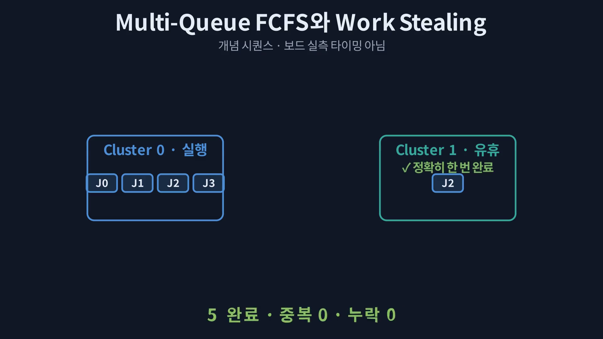

# VARP K26–Memory FPGA — 10분 기술 컨퍼런스 발표 아웃라인

상태: 사용자 중심 메시지 반영 완료, 아웃라인 및 source-asset mapping 승인 대기
형식: 16:9 · 10장 · 한국어 중심 · 10분
청중: FPGA/컴퓨터구조/온디바이스 AI 기술 컨퍼런스 청중

## 고정 중심 메시지

> Gemma 3 1B 작업 부하를 기준으로 K26 연산 SoC와 외부 Memory FPGA를 결합한 가속기 구조를 설계하고, Multi-Queue FCFS와 locality-aware Work Stealing이 정적 큐의 부하 불균형과 tail latency를 완화하는 조건을 분석하였다.

## 발표 리듬

`문제 제기 → 시스템 아키텍처 → Work Stealing 동작 원리 → 실험 설계 → 핵심 결과 → 물리 참조 설계 → 기여와 한계`

화면에는 짧은 제목, 한 줄 결론, 핵심 Figure만 남긴다. 아래의 설명 포인트는 최종 speaker notes로 이동하며 슬라이드 본문에 그대로 노출하지 않는다.

## Slide 1 — 정적 큐가 만든 Tail을 훔쳐라 (0:35)

- **화면 결론:** Gemma 3 1B decode의 병목을 ‘대역폭’이 아니라 ‘작업 배치와 tail’의 문제로 다시 본다.
- **발표 설명 포인트:** K26 compute SoC + external Memory FPGA, Multi-Queue FCFS, locality-aware Work Stealing.
- **Visual:** 어두운 캔버스 위 K26와 Memory FPGA 사이에 흐르는 weight tiles; 한쪽 queue만 길어진 장면.
- **역할:** cover / research hook.
- **Required images:** 없음. 구조를 과장하지 않는 개념 시각화만 사용.

## Slide 2 — 평균은 괜찮아도 Tail은 길다 (0:55)

- **화면 결론:** Static local queue는 locality를 지키지만 skew가 생기면 일부 cluster가 놀고 p95가 늘어난다.
- **발표 설명 포인트:** S1의 home ownership, queue imbalance, idle cluster, 평균보다 p95/p99가 중요한 이유.
- **Visual:** 동일 시간축 위 ‘긴 queue + idle cluster’ 대비; 마지막 5%의 지연을 cyan highlight.
- **역할:** problem framing / imbalance visualization.
- **Required images:** 없음. `results/experiments/scheduler_controlled.csv`의 skew 조건을 근거로 한 간결한 concept figure.

## Slide 3 — K26 Compute × Memory FPGA (1:10)

- **화면 결론:** 계산 소유권과 메모리 channel affinity를 분리해 tile 단위로 스케줄링한다.
- **발표 설명 포인트:** 4 compute clusters, TileScheduler/payload store/16×4 MatVec, 4-channel DDR3L 후보, 4-bundle link.
- **Visual:** 실제 RTL module map을 기반으로 좌→우 TileJob dataflow를 강조한 architecture hero diagram.
- **역할:** system architecture.
- **Required images:**
  - 실제 compute/memory/link plane과 연결 경계를 보존하는 strict input asset. 최종 슬라이드는 보고서 범례를 복제하지 않고, 실제 모듈명과 화살표를 중심으로 dark conference style에 통합한다.

    

## Slide 4 — Idle Cluster가 일을 훔치는 5단계 (1:15)

- **화면 결론:** S3는 가장 오래된 job이 아니라, age 대비 이동 비용이 이득인 eligible job을 훔친다.
- **발표 설명 포인트:** imbalance → victim search → locality score → steal → exact-once completion.
- **Visual:** Manim 시퀀스의 최종 dark frame을 중심으로 단계별 motion cue를 유지.
- **역할:** algorithm / process.
- **Required images:**
  - Manim으로 생성한 Work Stealing 정지 프레임; strict input asset. Queue/job identity와 단계 의미를 보존한다.

    

## Slide 5 — 실제 Graph에서 5,856개 TileJob으로 (1:00)

- **화면 결론:** 실제 Gemma graph에서 projection ledger를 만들고, 동일 job stream으로 정책만 바꿔 비교했다.
- **발표 설명 포인트:** 7,837 graph nodes, 183 projections/token, decode-32=5,856 jobs, 동일 seed/stream/correctness gate.
- **Visual:** ONNX graph → projection filter → deterministic ledger → S0/S1/S2/S3 replay의 한 방향 pipeline.
- **역할:** experiment design / method.
- **Required images:**
  - Graph inventory와 projection ledger 수치를 보존하는 strict input asset. ORT boundary 설명은 notes로 이동하고 figure의 핵심 pipeline만 사용한다.

    

## Slide 6 — S1은 기다리고, S3는 재배치한다 (1:05)

- **화면 결론:** 같은 skew workload에서 S3는 idle 구간을 steal 실행으로 바꿔 tail을 앞당긴다.
- **발표 설명 포인트:** S1 local wait, S3 victim dispatch, cluster별 실행 구간, remote movement의 추가 비용.
- **Visual:** 위 S1·아래 S3의 동일 축 swimlane/Gantt; queue wait·link/memory wait·compute를 색으로 분리.
- **역할:** comparison / execution timeline.
- **Required images:**
  - `results/experiments/scheduler_controlled.csv`와 scheduler event semantics로 생성할 `assets/s1_s3_execution_timeline.png`; strict input asset. Analytical timeline임을 작은 qualifier로 유지하고 임의의 RTL timing처럼 표현하지 않는다.

## Slide 7 — Tail Latency −18% (1:20)

- **화면 결론:** Full-overlap 분석에서 S3는 S1 대비 skew p95 18.12%, mixed p95 17.59%를 줄였다.
- **발표 설명 포인트:** p95와 p99를 함께 읽기, balanced/hotspot에서는 이득 없음, 동일 1,000-job stream과 seed 5개 중앙값.
- **Visual:** skew/mixed의 S1↔S3 p95/p99 dumbbell 또는 paired bars; 18.12%와 17.59%만 크게 강조.
- **역할:** key result / data evidence.
- **Required images:**
  - 수치·축·policy mapping을 보존하는 strict input asset.

    

## Slide 8 — 병목은 Queue에서 Link·Memory로 이동한다 (0:55)

- **화면 결론:** Stealing은 idle을 줄이는 대신 remote traffic을 만들며, locality score가 그 비용을 제한한다.
- **발표 설명 포인트:** S2→S3 remote weight bytes −37.84%/−22.16%, completion +0.98%/+0.41%, link/memory utilization과 queue wait의 관계.
- **Visual:** 왼쪽 queue wait 감소, 가운데 remote bytes, 오른쪽 link/memory pressure로 이어지는 bottleneck-shift plot.
- **역할:** trade-off / bottleneck transition.
- **Required images:**
  - `results/experiments/scheduler_controlled.csv`에서 생성할 `assets/bottleneck_shift.png`; strict input asset. Queue/link/DDR 지표의 단위와 analytical qualifier를 보존한다.
  - P95/completion/remote-byte 원 수치 교차검증용 strict evidence asset.

    

## Slide 9 — 알고리즘을 보드 경계까지 내리다 (0:55)

- **화면 결론:** Native KiCad reference design으로 물리 연결 대상을 구체화했지만 아직 제작 단계는 아니다.
- **발표 설명 포인트:** K26/Memory/GTH coupon, 실제 board source, bounded ERC/DRC, 55 unrouted nets.
- **Visual:** KiCad 3D render를 화면의 75% 이상 사용하고 작은 하단 qualifier만 배치.
- **역할:** physical reference design / visual proof.
- **Required images:**
  - 실제 board geometry와 silkscreen을 그대로 보존하는 strict input asset.

    

## Slide 10 — 기여: Tail을 줄일 조건을 찾았다 (0:50)

- **화면 결론:** 실제 Gemma workload·RTL scheduler·물리 reference를 연결해, Work Stealing이 유효한 조건과 다음 검증 단계를 제시했다.
- **발표 설명 포인트:** 기여 3개—graph-derived ledger, locality-aware policy trade-off, hardware integration roadmap.
- **한계 한 줄:** 현재 결과는 analytical/RTL-bounded이며 board 성능·전력과 닫힌 DDR→link→MatVec loop는 아직 검증 전.
- **Visual:** 3개의 큰 기여 키워드와 다음 단계 화살표 하나; 증거 등급 표나 행정형 카드 레이아웃 금지.
- **역할:** contribution / limitation / Q&A entry.
- **Required images:** 없음.

## Source-asset mapping

| Slide | Strict source asset | 역할 |
|---:|---|---|
| 3 | `paper_f01_evidence_path.svg` | 실제 RTL module/dataflow 구조 |
| 4 | `work_stealing_sequence_frame.png` | 실제 Manim 알고리즘 시퀀스 |
| 5 | `paper_f02_onnx_runtime_graph.svg` | 실제 Gemma graph→ledger 방법 |
| 6 | `s1_s3_execution_timeline.png` (아웃라인 승인 후 생성) | S1/S3 동일 축 실행 비교 |
| 7 | `paper_f05_tail_latency.svg` | p95/p99 핵심 결과 |
| 8 | `bottleneck_shift.png` (아웃라인 승인 후 생성) + `paper_f06_tradeoff.svg` | queue/link/memory 병목 변화와 trade-off |
| 9 | `paper_f07_kicad_coupon_render.png` | native KiCad physical reference |

## 확정된 디자인 제약

- Dark conference mode: `#07111F`–`#0B1627` 배경, cyan/teal/blue 포인트, 흰색 핵심 텍스트.
- 한 슬라이드 한 메시지. 화면 텍스트는 제목·한 줄 결론·figure label만 사용.
- 긴 문장, 보고서형 설명, 다중 카드 dashboard, 흰 배경 evidence matrix를 사용하지 않음.
- Figure를 크게 쓰고, 세부 정의·수치 조건·한계는 speaker notes로 이동.
- 분석 수치는 작은 `Analytical model` qualifier를 유지하되 발표의 전면 주제로 만들지 않음.
